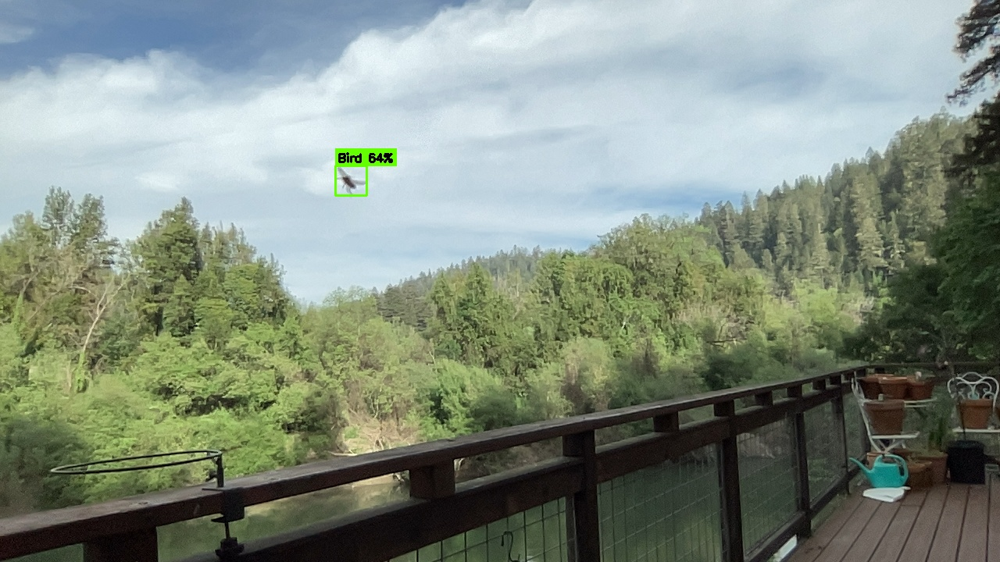
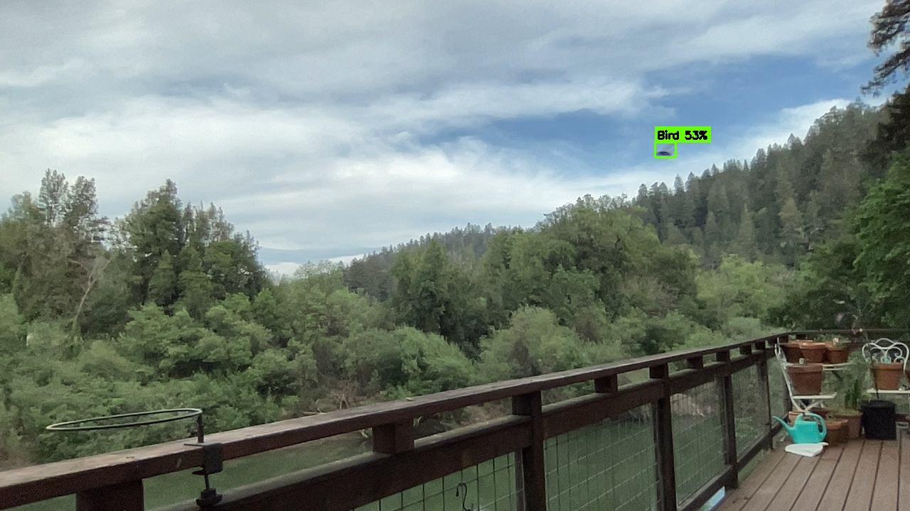

# 🐦 Bird Watcher

**Real-time bird detection for your backyard, porch, or feeder — powered by YOLOv11 and local AI.**

An [OpenClaw](https://openclaw.ai) skill that turns any Mac with a webcam into a live bird detection station. YOLO identifies birds in real-time with bounding boxes, Moondream VLM identifies the species, and you watch it all from your phone, tablet, or TV via a simple web link.

Everything runs locally on your machine. No cloud. No subscriptions. No data leaves your network.


*Real detection: bird in flight captured at 64% confidence with green bounding box, HUD overlay showing bird count and fps. Forestville, CA.*


*Second detection: bird at 53% confidence against the treeline. Outdoor deck setup, Sonoma County.*


---

## What It Does

You point a camera at your bird feeder. Bird Watcher does the rest:

- **Detects birds in real-time** using YOLOv11 — green bounding boxes appear the instant a bird enters the frame, even mid-flight
- **Identifies species when close enough** — when a detected bird is large enough in frame (50+ pixels), the system crops the region and asks a local VLM (Moondream) for species identification. Distant or fast fly-by birds get labeled "Bird" with confidence percentage. Species ID works best with birds perched nearby (feeders, railings, branches within ~15 feet of the camera).
- **Streams live video** to any device on your network — phone, tablet, laptop, or AirPlay to your TV
- **Saves every detection** — both the original frame and the annotated version with bounding boxes, timestamped
- **Logs to wildlife census** — if the OpenClaw `wildlife-census` skill is installed, sightings are recorded automatically


The camera feed and YOLO detection run in separate threads. The video is always smooth at full camera fps (~30fps). YOLO processes independently at ~10-15fps on Apple Silicon. You never see lag.

## How It Looks

When running, the stream shows:
- Live camera feed at native resolution (1280×720)
- Green bounding boxes on detected birds with confidence percentage
- Species label (from Moondream VLM) on each box
- HUD overlay: bird count, camera fps, YOLO fps, detection counter, last species identified
- Timestamp in the corner

## Requirements

### Hardware

| Component | Minimum | Recommended |
|-----------|---------|-------------|
| Mac | Any Mac with webcam | Apple Silicon (M1/M2/M3/M4) |
| Camera | Built-in MacBook camera | USB webcam for dedicated outdoor setup |
| RAM | 8GB | 16GB |
| Network | Not required for local use | WiFi for streaming to other devices |

Intel Macs work but expect ~5-8fps YOLO processing instead of 10-15fps.

### Software

- **Python 3.10 or newer** — check with `python3 --version`
- **macOS** — camera permissions require macOS Security & Privacy settings
- **Moondream Station** (optional) — for species identification. Without it, you still get bird detection with bounding boxes, just no species names.

### What This Skill Cannot Do

- **It cannot access the camera without your explicit permission.** macOS requires you to grant camera access interactively — no script can bypass this. You must run a command in Terminal and click "Allow."
- **It cannot stream to the internet by default.** The feed is only accessible on your local network. This is intentional for privacy. See the Security section below if you want remote access.
- **Species ID requires proximity.** Moondream is a general-purpose VLM, not a bird-specific model. It works best when birds are close to the camera — perched on a feeder, railing, or branch within about 15 feet. Distant birds and fast fly-bys are detected with bounding boxes but labeled generically as "Bird" rather than attempting an inaccurate species guess. Common backyard birds (jays, sparrows, robins, finches, hawks) at close range get reliable species identification.
- **It cannot run in the background on macOS.** The camera permission is tied to the foreground Terminal process. The script must run in an open Terminal window.

## Installation

### Step 1: Clone the repo

```bash
git clone https://github.com/MS-707/bird-watcher-skill.git
cd bird-watcher-skill
```

### Step 2: Install dependencies

**Recommended: use a virtual environment**
```bash
python3 -m venv venv
source venv/bin/activate
pip install -r requirements.txt
```

<details>
<summary>Alternative: system-wide install (not recommended)</summary>

```bash
pip3 install -r requirements.txt
```

If you get an `externally-managed-environment` error on newer Python:
```bash
pip3 install --break-system-packages -r requirements.txt
```

> ⚠️ **Warning:** `--break-system-packages` bypasses Python's environment isolation and can cause conflicts with system packages. Use a virtual environment instead whenever possible.

</details>

**Verify everything installed:**
```bash
python3 -c "import cv2, flask, ultralytics, requests; print('All dependencies OK')"
```

### Step 2.5: Install Moondream Station (optional — for species ID)

Species identification requires [Moondream Station](https://moondream.ai) running locally. Without it, birds are still detected with bounding boxes but labeled generically as "Bird" instead of by species name.

1. Visit **https://moondream.ai** for installation instructions
2. Once installed and running, verify with:
   ```bash
   curl http://localhost:2020/health
   ```
   You should see a JSON response with `"server": "moondream-station"`.
3. Bird Watcher will automatically detect Moondream on startup and enable species ID.

### Step 3: Grant camera permission

This is the most important step. Run this command **in Terminal** (not from a script):

```bash
python3 -c "import cv2; cap = cv2.VideoCapture(0); print('Camera:', cap.isOpened()); cap.release()"
```

macOS will show a permission dialog. **Click Allow.** You only need to do this once.

If it prints `Camera: True` — you're good. If `Camera: False` — go to System Settings → Privacy & Security → Camera and enable Terminal (or Python).

### Step 4: Start the stream

```bash
python3 main.py
```

The script will print a URL like:
```
🐦 Bird Watcher Live Stream v3
   🔐 Stream URL: http://YOUR_LOCAL_IP:8888?token=abc123xyz
```

Open that URL on your phone or any device on the same WiFi. The token is generated fresh each time you start the stream — only people with the URL can view your camera feed.

> **Note:** `bird_watcher_stream.py` is kept as a backwards-compatible wrapper that calls `main.py`.

## Configuration

All settings can be passed via CLI flags or environment variables:

```bash
# CLI flags
python3 main.py --port 9999           # Custom port
python3 main.py --model yolo11n.pt     # Nano — fastest, less accurate
python3 main.py --model yolo11m.pt     # Medium — slower, more accurate
python3 main.py --confidence 0.20      # Higher = fewer false positives
python3 main.py --persist 5            # Seconds to keep bounding box visible
python3 main.py --no-save              # Don't save detection frames to disk

# Environment variables
BIRDWATCH_PORT=9999 python3 main.py
BIRDWATCH_MODEL=yolo11n.pt python3 main.py
BIRDWATCH_CONFIDENCE=0.20 python3 main.py
MOONDREAM_URL=http://192.168.1.50:2020 python3 main.py
```

| Environment Variable | Default | Description |
|---------------------|---------|-------------|
| `BIRDWATCH_PORT` | 8888 | HTTP port for stream server |
| `BIRDWATCH_MODEL` | yolo11s.pt | YOLO model file |
| `BIRDWATCH_CONFIDENCE` | 0.15 | Detection confidence threshold |
| `BIRDWATCH_PERSIST` | 3 | Seconds to keep bounding boxes visible |
| `BIRDWATCH_TOKEN` | (random) | Stream authentication token |
| `BIRDWATCH_MAX_FILES` | 500 | Max saved detection frames before cleanup |
| `BIRDWATCH_MAX_VIEWERS` | 5 | Max concurrent stream viewers |
| `BIRDWATCH_MIN_BIRD_SIZE` | 50 | Min pixel size to trigger species ID |
| `MOONDREAM_URL` | http://localhost:2020 | Moondream VLM endpoint |
| `BIRDWATCH_DURATION` | 1800 | Batch mode: total run time in seconds |
| `BIRDWATCH_INTERVAL` | 8 | Batch mode: seconds between captures |

### YOLO Model Comparison

| Model | Size | FPS (M1) | FPS (Intel) | Accuracy | Use Case |
|-------|------|----------|-------------|----------|----------|
| `yolo11n.pt` | 5MB | 15-25 | 8-12 | Good | Smooth streaming, less accurate |
| `yolo11s.pt` | 18MB | 10-15 | 5-8 | **Better** | **Recommended balance** |
| `yolo11m.pt` | 39MB | 5-8 | 2-4 | Great | Serious detection, still watchable |
| `yolo11l.pt` | 87MB | 2-4 | <2 | Excellent | Maximum accuracy, slideshow fps |

Models auto-download on first run. They detect "bird" as one of 80 COCO object classes. No custom training needed for general bird detection.

## Project Structure

```
bird-watcher-skill/
├── main.py                    ← Primary entry point (live stream)
├── bird_watcher_stream.py     ← Backwards-compatible wrapper → main.py
├── bird_watcher_batch.py      ← Batch detection mode (interval captures)
├── config.py                  ← argparse CLI + env var configuration
├── camera.py                  ← Camera capture thread + HUD overlay
├── detector.py                ← YOLO detection thread + frame saving
├── species_id.py              ← Moondream VLM species identification
├── storage.py                 ← Directory management + cleanup
├── stream_server.py           ← Flask MJPEG server + auth
├── requirements.txt
├── yolo11s.pt                 ← YOLO model (auto-downloaded)
├── SKILL.md                   ← OpenClaw skill definition
└── detections/                ← Saved detection frames (auto-managed)
```

## Architecture

```
┌─────────────────────────────────────────────┐
│                 Camera Thread               │
│  cv2.VideoCapture(0) → 30fps raw frames     │
│  Overlays latest YOLO boxes onto each frame │
│  Encodes as JPEG → MJPEG stream             │
└──────────────────┬──────────────────────────┘
                   │ shares frames via lock
┌──────────────────▼──────────────────────────┐
│                 YOLO Thread                 │
│  Pulls latest frame independently           │
│  Runs YOLOv11 detection (bird class only)   │
│  Stores bounding box coordinates + conf     │
│  Saves detection frames to disk             │
└──────────────────┬──────────────────────────┘
                   │ on bird detection (5s cooldown)
┌──────────────────▼──────────────────────────┐
│              Moondream Thread               │
│  Crops detected bird region + padding       │
│  Sends to local VLM for species ID          │
│  Updates species label on HUD               │
└─────────────────────────────────────────────┘
```

The camera thread never waits for YOLO. YOLO never waits for Moondream. Each runs at its own natural speed. The video feed is always smooth.

## Detection Output

Every time a bird is detected, two files are saved to `./detections/`:

```
detections/
├── orig_20260321_152401_728656.jpg   ← original frame, no annotations
├── det_20260321_152401_728656.jpg    ← annotated with bounding boxes
├── orig_20260321_153211_614977.jpg
├── det_20260321_153211_614977.jpg
└── session_20260321_160000.json      ← session summary (batch mode only)
```

Files auto-rotate after 500 frames to prevent filling your disk. Oldest files are deleted first. Adjust via the `BIRDWATCH_MAX_FILES` environment variable or `--max-files` flag.

## Batch Mode

For unattended monitoring (no live stream, just detection logging):

```bash
python3 bird_watcher_batch.py --duration 3600 --interval 10
```

Captures a frame every 10 seconds for 1 hour. Runs YOLO + Moondream on each frame. Saves detections. Prints a summary at the end. Good for understanding when birds visit your feeder.

## Security Considerations

This skill accesses your camera and streams video on your local network. Please understand:

- **Camera access** is gated by macOS permissions. No script can access your camera without your explicit consent via the system dialog.
- **Stream authentication** — a random token is generated each time you start the stream. Only devices with the full URL (including token) can view the feed. The token is printed in your Terminal when the stream starts.
- **Local network only** — the stream is NOT accessible from the internet by default. It binds to your local IP address. Only devices on your WiFi can connect.
- **No cloud services** — YOLO runs locally via PyTorch. Moondream runs locally. No images or video are sent to any external server. Everything stays on your machine.
- **Detection frames on disk** — saved frames contain images from your camera. They're stored in the `detections/` folder. Be aware of this if you share your computer or back up to cloud storage. Auto-cleanup removes old files after 500 frames.
- **Viewer limit** — maximum 5 concurrent viewers to prevent resource exhaustion.
- **Flask development server** — the built-in web server is suitable for home use but not hardened for public internet exposure. Do not expose this directly to the internet without a reverse proxy and proper TLS.

**If you want remote access** (viewing from outside your home network), consider:
- [Tailscale](https://tailscale.com) — free, creates a private VPN between your devices
- An SSH tunnel — `ssh -L 8888:localhost:8888 your-mac-ip`
- Do NOT use ngrok or port forwarding without understanding the privacy implications of exposing your camera feed

## OpenClaw Integration

Bird Watcher works standalone, but it's designed to integrate with the OpenClaw agent ecosystem:

- **[Wildlife Census](https://github.com/MS-707/wildlife-census-skill)** — separate OpenClaw skill for species logging and life lists. If installed, every Bird Watcher detection is automatically logged with species, count, and timestamp

- **Telegram Alerts** — your OpenClaw agent can send detection photos to Telegram when a bird is spotted
- **Scheduled Sessions** — set up cron jobs to run batch detection during peak feeding times (early morning, late afternoon)

## Troubleshooting

| Problem | Solution |
|---------|----------|
| `Camera: False` or black screen | Run the camera permission command interactively in Terminal. Click Allow. |
| `OpenCV: not authorized to capture video` | Must run in foreground Terminal, not via nohup, background, or exec. |
| Stream works on Mac but not phone | macOS firewall is blocking. Disable temporarily or add Python to allowed apps. |
| Low fps (<5) | Use `--model yolo11n.pt` for faster processing. Close GPU-heavy apps. |
| No species identification | Moondream Station not running. The stream still works — you just get "Bird" instead of species names. |
| `Address already in use` | Previous instance still running. `kill $(lsof -ti:8888)` or use `--port 9999`. |
| Birds not being detected | Lower threshold: `--confidence 0.10`. Move camera closer to feeder. Ensure birds aren't too small in frame. |
| `ModuleNotFoundError` | Run `pip3 install -r requirements.txt` again. Check you're using the right Python. |

## Credits & Acknowledgments

- **[YOLOv11](https://github.com/ultralytics/ultralytics)** by Ultralytics — the object detection model
- **[Moondream](https://moondream.ai/)** — local vision-language model for species identification

- **[OpenClaw](https://openclaw.ai)** — the agent framework this skill is designed for
- **[Birds-YOLO](https://pmc.ncbi.nlm.nih.gov/articles/PMC12650164/)** — research paper on YOLOv11 bird detection that inspired the approach

## Contributing

Issues and pull requests welcome. If you improve the detection, add support for new platforms (Linux, Windows), or create a better dashboard UI, we'd love to see it.

## License

MIT — see [LICENSE](LICENSE) for details.

Created by Mark Starr & Victor as an open-source [OpenClaw](https://openclaw.ai) skill. Free to use, modify, and share.
